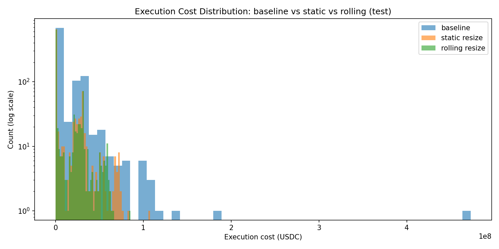

## Executive Summary

This project studies **execution risk on Uniswap v3** from the perspective of
a professional trading firm executing large swaps.

Instead of focusing on average slippage, I model **right-tail execution cost**
as a function of *execution pressure*:

    z = trade_size / in-range liquidity

Using real Arbitrum USDC–WETH swaps, I show that:
- Extreme execution losses are driven by high-z trades
- Simple z-based execution rules can materially reduce tail risk
- Rolling (adaptive) z thresholds outperform static rules

This project demonstrates how **on-chain microstructure data** can be turned
into **practical execution controls** suitable for systematic trading.

## Key Result: Tail Execution Risk Reduction


This figure compares the distribution of execution costs under three policies:

- **Baseline**: execute full trade size on every swap
- **Static resize**: cap trade size using a fixed z-threshold
- **Rolling resize**: adaptively cap trade size using a rolling z-cap

While average execution costs are similar across strategies, the baseline exhibits
a pronounced right tail, driven by a small number of swaps executed under extreme
liquidity pressure.

The rolling resize rule substantially compresses this right tail, reducing extreme
loss events without materially reducing execution coverage. This demonstrates that
execution risk on Uniswap v3 is highly state-dependent and benefits from adaptive,
data-driven controls rather than static thresholds.

## My Role & Positioning

This project reflects how I would contribute in a quantitative trading team:

- Execution risk modeling
- On-chain market microstructure analysis
- Design of rule-based execution controls
- Translating data insights into deployable trading logic

This is not a trading alpha project, but an **infrastructure-level execution and risk project**.

## Project Pipeline

Raw on-chain data
    ↓
Uniswap v3 Swap Logs (RPC)
    ↓
State reconstruction (price, liquidity)
    ↓
Execution pressure feature (z)
    ↓
Slippage & tail-risk analysis
    ↓
Execution rules (filter / resize)
    ↓
Static backtest
    ↓
Rolling adaptive backtest

## How to Run This Project

This repository is organized as a simple, sequential pipeline.  
Each step can be executed independently, but is designed to be run in order.

### 1. Install Dependencies

```bash
pip install -r requirements.txt
```
### 2. Fetch Uniswap v3 Swap Data (Arbitrum)

```bash
python src/01_fetch_swaps.py
```
This script:

-Connects to an Arbitrum RPC endpoint

-Pulls raw Swap events from a Uniswap v3 pool (USDC–WETH, 0.05% fee tier)

-Stores decoded swap data in a local SQLite database: data/univ3.db

###  3. Build Execution Risk Features
```bash
python src/01_fetch_swaps.py
```
This step constructs per-swap execution features, including:

-Execution price

-Reference price (previous swap price)

-Slippage

-Trade size (USDC notional)

-In-range liquidity (from previous swap)

-Execution pressure proxy: z = trade_size / liquidity_prev

-The output is written to the swaps_features table in the database.

###  4. Backtest Execution Rules
```bash
python src/05_backtest_z_filter.py  #Baseline vs z-filter execution
python src/06_backtest_resize.py    #Resize execution rule (static z-cap)
python src/07_backtest_rolling_resize.py #Rolling adaptive resize rule
```
These scripts evaluate how different execution policies affect execution cost distributions, with a focus on right-tail (p99) risk.

### 5. View Results
```bash
figures/
```
Key result figures include:

-backtest_rolling_cost_hist.png

-rolling_z_cap_path.png


```markdown
> Note: The analysis uses historical swap data and is intended to study
> execution risk characteristics rather than simulate a live trading system.
```


# Execution Risk Modeling on Arbitrum Uniswap v3 (USDC–WETH)

## What Problem Does This Project Solve?

On AMMs like Uniswap v3:

- Execution cost is **non-linear**
- Liquidity is **concentrated and state-dependent**
- A small number of swaps cause **disproportionately large losses**

Traditional approaches that look only at average slippage miss this risk.

**This project focuses explicitly on tail risk**:
- p95 / p99 execution cost  
- extreme loss prevention  
- adaptive sizing under changing liquidity regimes  

---

## Data Source

- **Chain**: Arbitrum (chainId = 42161)  
- **Pool**: Uniswap v3 USDC–WETH (0.05% fee tier)  
- **Source**: Raw on-chain logs via JSON-RPC  
- **Storage**: Local SQLite database (`data/univ3.db`)  

No subgraph or third-party dataset is used.

---

## Key Idea: Execution Pressure

For each swap, I define the **execution pressure variable**:
z = trade_size_usdc / in_range_liquidity_prev

Where:

- **`trade_size_usdc`**  
  The notional size of the swap, measured in USDC.

- **`in_range_liquidity_prev`**  
  The active (in-range) liquidity *before* the swap occurs, taken from the previous swap state.

This ratio measures **how aggressive a trade is relative to the available liquidity at execution time**.

---

## Why This Variable Matters

In Uniswap v3, liquidity is **concentrated within price ranges** rather than uniformly distributed.

As a result:

- Two trades of the same size can have **very different slippage**
- The key driver is **how much liquidity is actually active at that price**
- Execution cost grows **non-linearly** as trade size approaches in-range liquidity

The variable `z` captures this interaction in a **scale-free** way.

---

## Empirical Observation

After binning swaps by `z` and examining the slippage distribution within each bin, we observe:

- Mean slippage increases slowly with `z`
- **Right-tail slippage (p95 / p99) increases sharply**
- A small fraction of high-`z` swaps dominates total execution loss

This confirms that **execution risk is primarily a tail-risk problem**, not an average-cost problem.

---

## Slippage Definition

For each swap, slippage is defined as:
slippage = (execution_price - reference_price) / reference_price


Where:

- **`reference_price`**  
  The pool price *before* the swap, computed as:
price = (sqrtPriceX96 / 2^96)^2


- **`execution_price`**  
The realized execution price of the swap:
execution_price = amount_in / amount_out


Slippage is positive when execution is worse than the pre-swap pool price.

---

## Why Focus on the Right Tail

From an execution and risk-management perspective:

- Median slippage is often near zero
- **Extreme slippage events dominate P&L impact**
- Risk controls should be designed around:
- p95 / p99 cost
- worst-case execution outcomes

This motivates the design of **z-based execution rules** that explicitly target the right tail.

---

## From Measurement to Control

Once `z` is computed for each swap, it enables:

- **Trade filtering**  
Skip execution when `z` exceeds a risk threshold

- **Trade resizing**  
Scale order size down to keep `z` within acceptable bounds

- **Rolling risk adaptation**  
Adjust `z` thresholds dynamically using recent data

These controls are evaluated via backtesting in later stages of the project.

---

## Key Insight

- Execution risk on AMMs is best understood as a function of **trade size relative to in-range liquidity**, not absolute trade size.

- The variable `z` provides a simple but powerful way to quantify and manage this risk.


